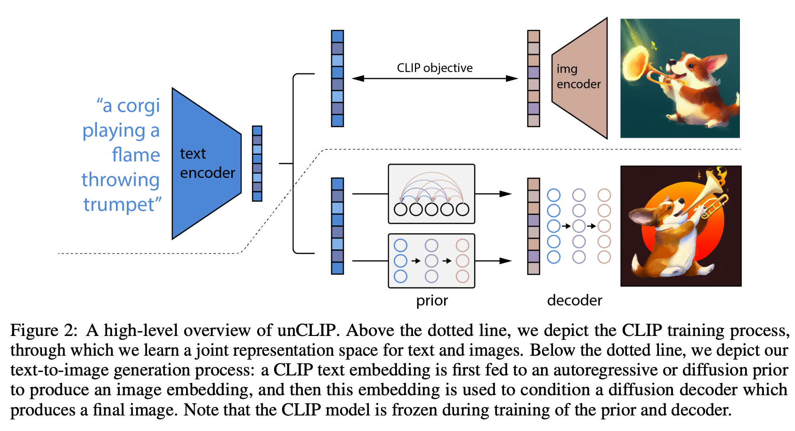

Hierarchical Text-Conditional Image Generation with CLIP Latents
==
### Arxiv 22.04 (aka DALL-E2)

CLIP같은 contrastive model들은 이미지의 robust한 representation(semantic, style)을 잘 학습한다.
이 representation을 이미지 생성에 활용하는 것이 목적이다.

1. Pre-trained CLIP model을 사용한다. (점선 윗 부분)
2. CLIP의 text encoder의 출력인 text embedding을 prior를 통해서 image embedding으로 만들어준다.
3. 이 image embedding을 decoder(=upsampling diffusion)를 사용해서 고해상도의 이미지로 만든다.

* P(x | z_i, y) : decoder
* P(z_i | y) : prior
* y → x : text → image
* z_i : CLIP image embedding /  z_t : CLIP text embedding

### Decoder
* GLIDE 모델를 기반으로 사용. 기존 timestep 임베딩에 CLIP 임베딩도 같이 투영하여 사용.
* 이 후에는 두개의 unconditional diffusion을 사용해서 SR을 함
64x64 => 256x256 / 256x256 => 1024x1024로 2개의 diffusion model을 사용하여 upsampling함.

### Prior
여기서 Prior는 CLIP의 text encoder의 output을 image embedding으로 만드는 모델을 말한다.
이 논문에서는 Auto Regressive방식과 Diffusion방식을 비교하는데 결국 Diffusion 방식을 채택한다.
* Auto Regressive prior
  * PCA를 통해서 319차원으로 축소 (reconstruction 이미지의 MSE가 1%미만인 경우라고 한다.)
  * Transformer기반의 Auto Regressive모델을 학습한다.
  * (Decoder의 입력은 64x64로 들어가야 할텐데 이것에 대한 언급은 없다.)

* Diffusion prior

  * noised z_i, 텍스트 y, 타임스텝 t를 입력으로해서 unnoised z_i를 예측하도록 학습
  * 2개를 생성하고 z_t와 내적한 유사도가 높은 것을 선택해서 사용

## Image Manipulations
### Variations

### Interpolation

디코더로 들어가기 이전 z_i를 interpolation하여 blended 이미지를 만들 수 있다.

### Text Diffs

원래 텍스트와 새로운 텍스트에 대해서 z_t에서 차이를 구한다음에 원래 이미지에 해당하는 z_i를 변형하여서 생성
