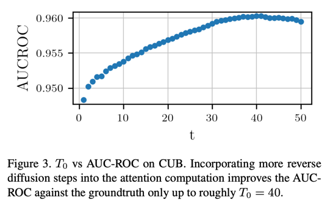
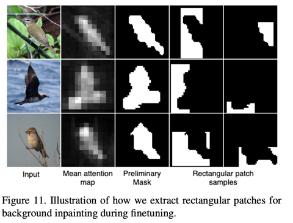
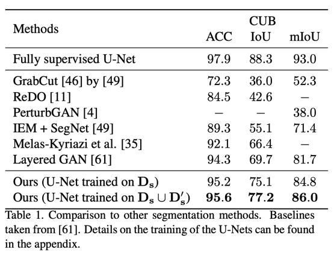
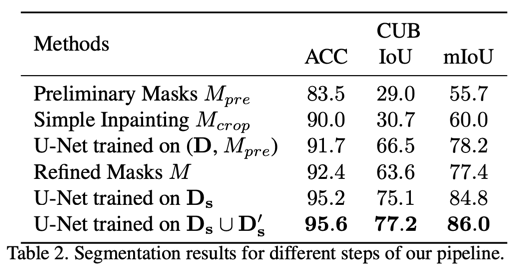

Foreground-Background Separation through Concept Distillation from Generative Image Foundation Models
===
LDM을 통해서 이미지를 생성할 때 attention map을 사용해서 segmentation mask를 같이 만들겠다는 연구

1. 이미지에서 attention mask를 추출, GMM으로 이진화한다.
2. Diffusion 모델이 배경만 생성할 수 있도록 fine-tuning한다.
3. 생성된 배경을 사용해서 마스크를 refine해준다.

### Preliminary mask extraction
여기서 기본적으로 해당 객체가 존재하는 데이터셋이 있고, foundation 모델이 해당 객체의 의미를 학습했다는 것을 가정하고 있다. 

* D: original dataset
* D_m: unsupervised segmenation masks of D
* D': synthetic images
* D'_m: masks of D'
* D'_f: foreground images of D'
* D'_b: background images of D'
* D'_S = {D', D'_m, D'_f, D'_b}

라고 했을 때 최종 목표는 D_m과 D'_s를 얻는 것이다.

여기에서는 cross-attention 맵의 모든 레이어를 사용했다.

t스텝, l번째 레이어에서의 어텐션 값

T_0는 실험적으로 40을 사용한다. (전체 스텝은 50)

t가 클 때는 pure 가우시안 노이즈에 가깝기 때문에 오히려 구조적인 정보가 적기 때문에 성능이 떨어진다.

이후 GMM을 사용해서 바이너리 마스크 M_pre 를 만든다. 
높은 값을 객체, 낮은 값을 비객체로 하여 GMM을 모델링하여 이진화한다. 
이 후 mean filter를 사용해서 orphan픽셀을 제거한다.

### Fine-tuning and Mask Refinement
LDM을 사용하고 있기 때문에 마스크의 해상도가 64x64이다. 
이 영향으로 마스크가 객체의 sharp edges보다 크게 만들어진다. 
인페인팅할때는 충분하겠지만, 객체만 분리하기에는 문제가 있다. 
이를 해결하기 위해서 모델을 fine-tuning한다.
1. M_pre를 기준으로 배경만 "a photo of a background"로 학습한다. 
2. 동시에 전체 이미지에 대해서 "a photo of a {object}"로 학습한다. 

이 후 원본 이미지에서 M_pre 영역을 백그라운드로 인페인팅한 결과를 사용해서 최종 마스크를 만든다.   

* M_pre,up: M_pre를 이미지 사이즈로 업샘플링
* g: 위에서 사용했었던 GMM 모델
* x: 입력 원본 이미지
* m': fine-tuned LDM
* z_0~: 6번식에 나온 것처럼 배경 영역은 원본 latent, 마스크 안쪽은 랜덤 값
즉 생성된 배경 이미지와 원본 이미지의 차이를 사용해서 값이 큰 경우 객체 영역으로 포함되게 해준다.

최종적으로는 이 만들어진 마스크를 사용해서 U-Net을 학습시켜서 segmentation 모델로 사용한다.

