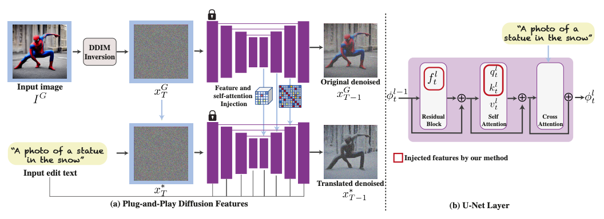
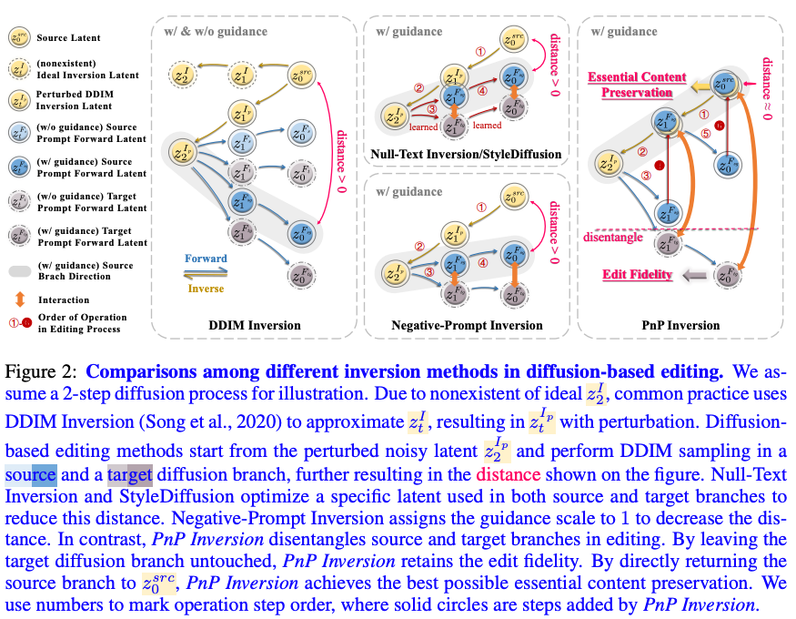
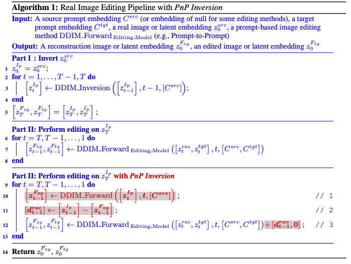
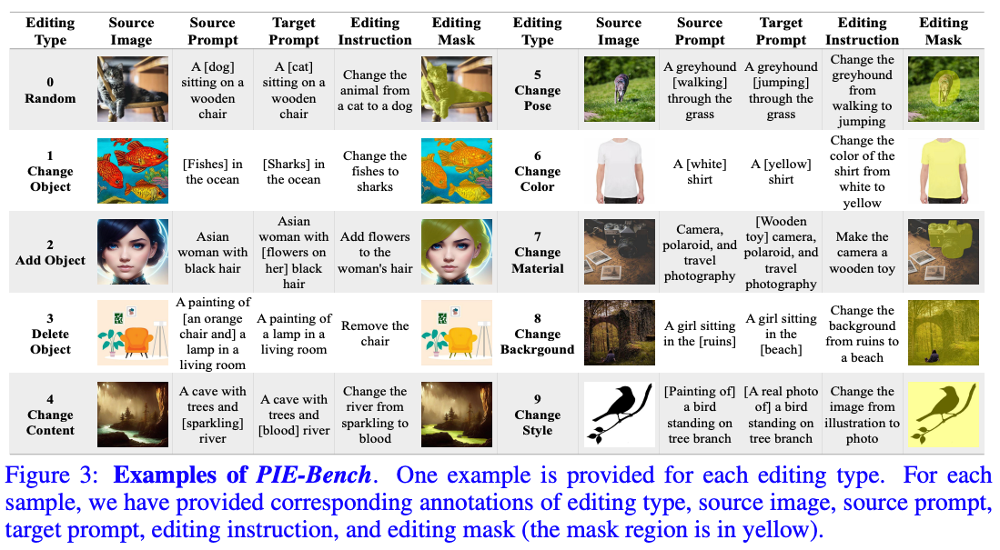
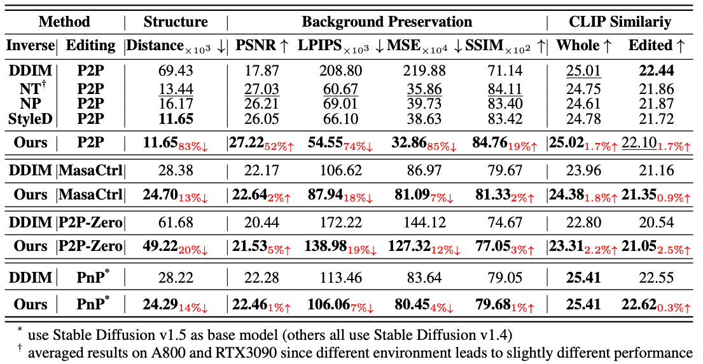
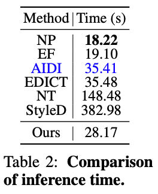
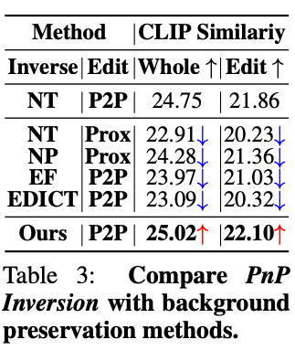
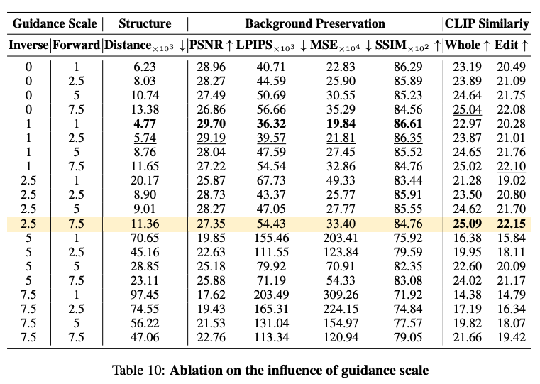

DIRECT INVERSION: BOOSTING DIFFUSION-BASED EDITING WITH 3 LINES OF CODE
===
ICLR 2024 / arxiv 23.10  

## Introduction
* P2P, MasaCtrl과 같은 분기가 나눠저서 에디팅하는 모델들을 대상
    *   
    *   
    *   

이렇게 분기를 나누는 이유는 Inversion 후 텍스트만 바꾼다고 에디팅이 잘 되지 않기 때문에 원본의 정보를 추가로 넘겨주는 것이다.  
일반적으로 DDIM Inversion > 성능 이슈로 NTI > 효율성으로 NPI가 나왔지만 NPI도 NTI보다는 오히려 성능이 떨어진다.  

**_Inversion의 정확한 목표는 무엇이고 이러한 최적화가 정말 필요한가?_**  

  
DDIM Inversion의 approximate로 인해 inversion latent는 왜곡이 생길 수 밖에 없다.  
NTI나 NPI나 결국은 sampling된 결과를 forward된 z와 가깝게 만들려는 노력이다. (파란색을 노란색으로)  
>   
> DDIM Inversion의 가정을 생각하면 forward와 reverse의 한 스텝 차이를 메꾸기 위한 것이 목적이다라는 의미로 해석된다.  

소스와 타겟이 공유하는 unconditional의 결과를 최적화시켜서 에디팅된 결과(회색)도 원본과 가까워지기를 기대한 것이다.  
하지만 이 논문은 소스와 타겟을 분리시키고 소스를 강제로 원본으로 되돌리는 방법으로 원본의 핵심 contet는 유지하면서 편집의 fidelity도 유지(?)한다.

* 단 세줄의 코드만으로 두 분기 최적의 성능을 달성한다.  
* 700개의 이미지로 구성된 벤치마크 PIE-Bench를 제안한다.  
* 8개 편집 방법에서 SOTA이면서 속도도 거의 한 차수가 향상된다.  

***
## Motivation
1. 이전 Inversion 방법들 중에서 최적화 기반의 방법이 왜 더 나은 성능을 보이는가?  
    DDIM sampling의 분포에 영향을 주지 않으면서, 충분한 text condition에 대한 guidance를 유지하면서 Diffusion의 편집 가능성을 유지한다.  
    > 예시 모델이 있긴 한데 요점은 소스 브랜치를 원본에 가깝게 해주는 것이 성능에 영향이 좋다는 의미인 것 같다.  
2. 이러한 최적화는 Diffusion에서 필수인가?  
    소스 브랜치(파란색)을 원본(노란색)으로 만드는 것이 최종적인 목표이다.   
    하지만 3가지의 문제가 있다.
   * 최적화 시간이 너무 오래걸린다. (NTI: 이미지당 148.48초)  
   * 시간을 줄이려고 횟수를 제한하니 최적화가 덜 되어서 갭이 커진다.  
   * 학습된 변수가 입력으로 사용되는데, 이는 Diffusion의 예상 입력 분포와 align되어있지 않다.  
     이는 Diffusion의 무결성과 타겟 브랜치에 부정적인 영향을 준다.
     > 학습할 때의 uncondition과 다르다는 의미인 것 같다. 솔직히 무결성은 무슨 말인지 모르겠다.  
  
## Method  
  
> t에서 t-1로 가는 걸 Forward라고 표기했는데, 헷갈리긴 하지만 Inversion의 반대라고 생각하자.  
1. Inversion된 t스텝의 z(노랑)를 기준으로 t-1스텝의 z_source(파랑)를 구한다.
2. 1의 결과인 t-1스텝의 z_source와 t-1스텝의 z의 차이를 구한다.
3. 2에서 구한 차이를 t-1스텝의 z_source와 z_target(회색)에 모두 더해서 z로 shift 시킨다.  

이렇게 했을 때에 "편집 가능성"을 유지할 수 있는 것이 핵심이다.  
> 원본의 content를 잘 유지하면서 타겟 프롬프트를 사용한 편집을 방해하지 않는다는 의미인 것 같다.  

## Benchmark Construction  
  
PIE-Bench(Prompt-based Image Editing Benchmark)

***
## Experiments  
*   
*   
*   
*   
*  
