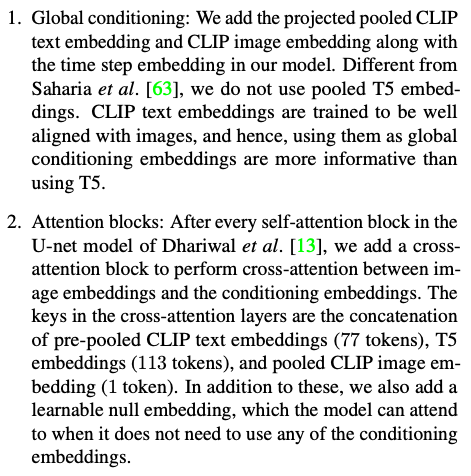
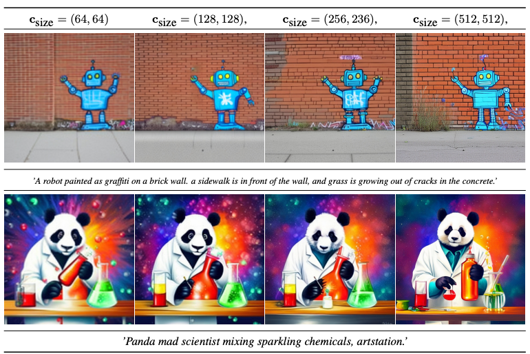
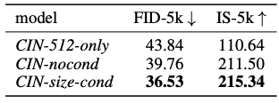
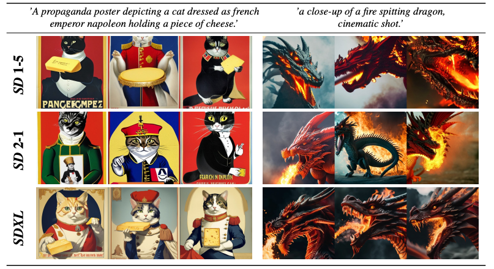
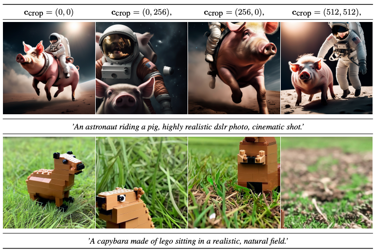
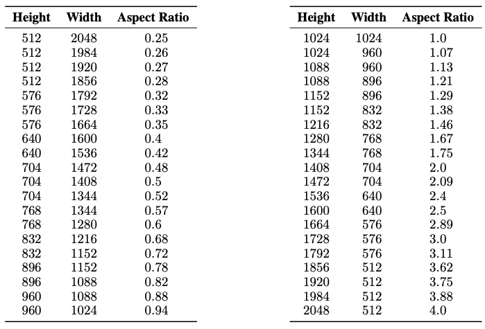

SDXL: Improving latent Diffusion models for high_resolution image synthesis
===
ICLR 2024 / arxiv 23.07  
* 3배 큰 UNet-backbone  
* 간단하지만 효과적인 2가지 conditioning 방법
* Refiner 추가  
 
***

## Architecture & Scale  
Simple Diffusion 논문을 참고하여 설계하였다.  
Simple Diffusion에서의 주요 변화점은 2가지이다.  
1. **실험적**으로 16x16 feature에서 가지고 노는게 성능이 좋더라, ViT도 16x16으로 하지 않았냐  
    => 따라서 이 논문에서도 가장 안쪽 레이어(16x16->8x8)을 제거한다.  
2. 큰 feature map으로 트랜스포머 block에 연산하는게 부담이 크다. 막상 빼보니 **경험적**으로 큰 영향 없더라.  
    => 따라서 이 논문도 저수준 특징에서 집중적으로 트랜스포머 연산을 수행한다.  

  

text condition 방법은 eDiff-I 논문을 참고한다.  
  
* text prompt를 CLIP embedding > average pooling > time step과 같이 모델 input  
* CLIP embedding과 T5 emnedding을 concat해서 cross-attention에 입력  

최종적으로 모델 크기가 3배정도로 증가한다.  
 
***

## Micro-Conditioning  
### Conditioning the Model on Image Size
기존에는 입력 사이즈가 512이기 때문에 그보다 작은 이미지는 학습에 사용하지 않았다.  
업샘플링을 할 경우 흐린 결과를 생성하는 문제가 발생한다. (FID도 감소함)  
이 논문에서는 이를 보완하기 위해 원본 사이즈를 추가 조건으로 입력한다.  
  
csize = (horiginal, woriginal) 에 대해서 각 요소를 Fourier feature encoding해서 timestep과 같이 입력해준다.  
이 후 생성할 때도 이미지 사이즈를 condition으로 줄 수 있다.  

  
  

### Conditioning the Model on Cropping Parameters  
  
방대한 데이터셋을 쓰다보니 이미지의 해상도가 항상 일정하지 않다.  
그래서 학습할 때에 랜덤하게 crop된 영역에 text prompt가 다 표현되어있지 않거나 객체가 잘리는 경우가 있는데,  
이러한 경우 위에 케이스처럼 잘린 이미지가 생성될 수 있다.  
이를 방지하기 위해서 위에서와 똑같은 방법으로 crop한 영역에 대한 정보를 top과 left로 입력해준다. (사이즈는 어차피 모델 입력과 동일)  
  
그 결과 생성할 때에도 crop 영역을 가이드할 수 있게 된다.  

***
## Multi-Aspect Training  
  
해상도 비율이 비슷한 이미지들을 모아서 같은 배치로 학습한다.  
또한 위와 마찬가지로 car = (htgt, wtgt) 를 condition으로 사용한다.  
이렇게 했을 때 crop conditioning을 보완해준다고 한다.  

***
## Improved Autoencoder  
생성된 이미지의 고주파 디테일을 개선하기 위해서 기존보다 더 큰 batch size로 ema사용해서 fine-tuning한다.  
  

***
## Putting everything together
1. Autoencoder 추가 학습  
2. 256x256 이미지를 2048 배치 크기로 60만 step 학습 (대략 300에폭)  
3. 512x512 이미지 20만 step 학습   
4. multi-aspect training을 사용하요 1024x1024 학습

***
  
