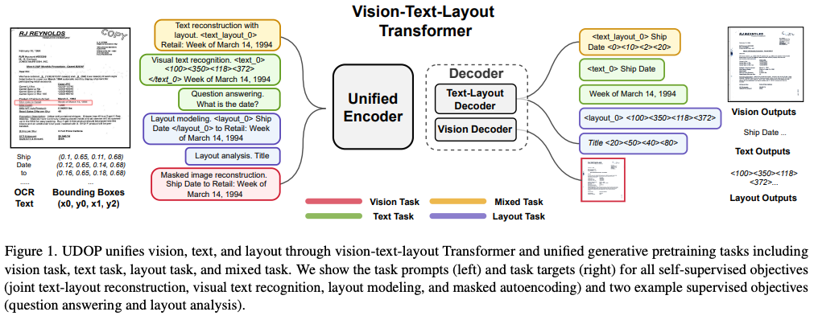
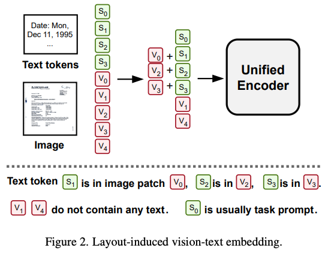
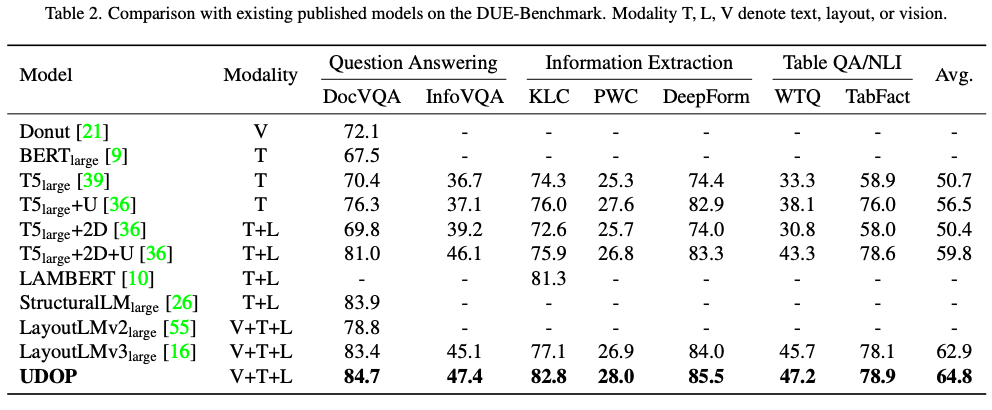
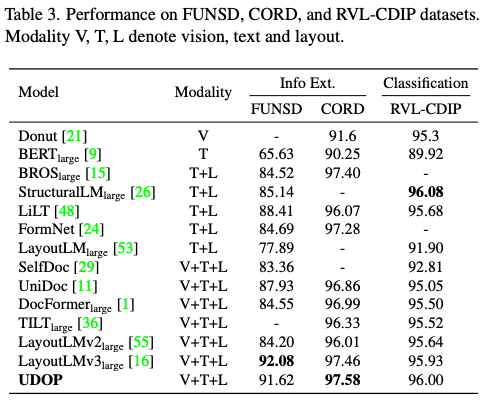
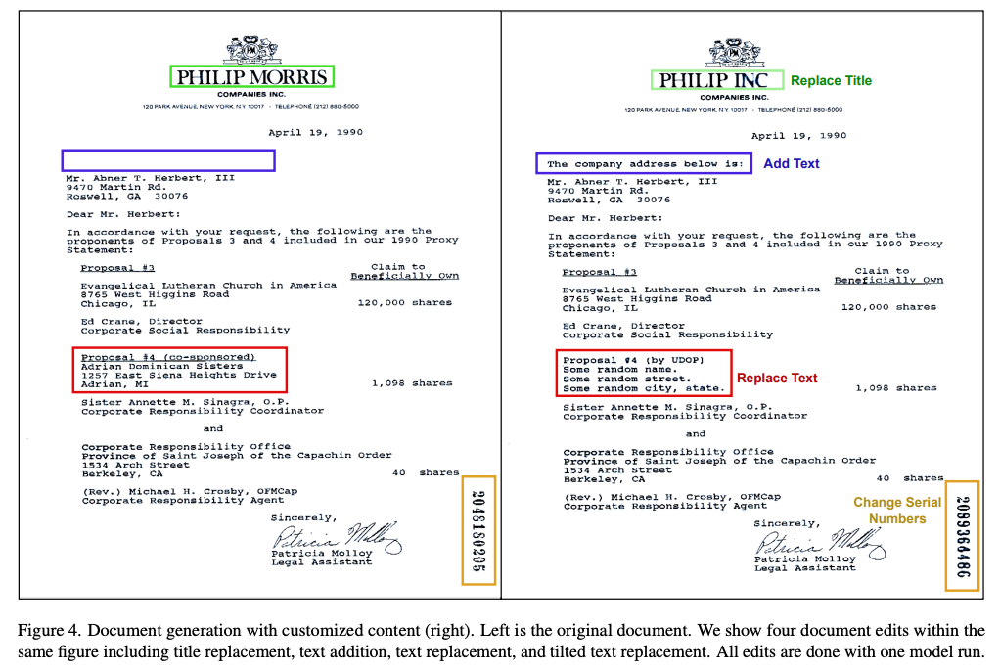
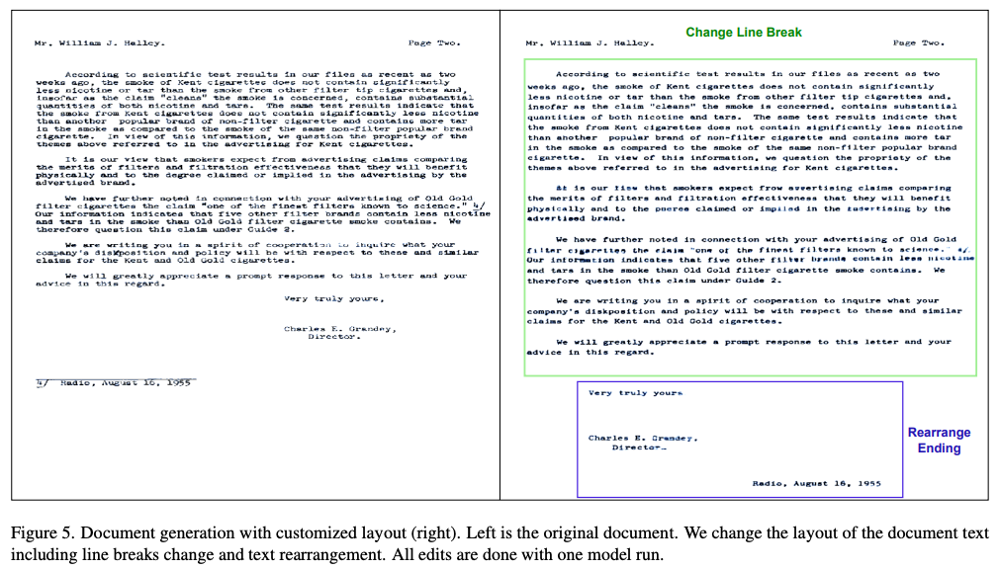

Unifying Vision, Text, and Layout for Universal Document Processing
===
CVPR 2022 / arxiv 22.12 / 50 Citations (24.04.13)
####
## Introduction  
Document Understanding은 기호, 그림, 스타일과 같은 시각 정보와 함께텍스트 내용을 인식하는 멀티모달 task이다.  
게다가 텍스트는 인보이스, 세금 양식, 논문 등 어떤 문서인지에 따라서 유형과 배치의 차이가 크다.  
이를 효과적으로 이해하기 위해서는 레이아웃을 모델링하고 이해하는 것이 중요하다.  
최근 연구들은 단순히 2D positional embedding을 사용하기 때문에 내재된 양식간의 상관관계를 충분히 활용하지 못한다.  
###
## Universal Document Processing

####
* v: 문서 이미지
* {s_i}: OCR 결과 텍스트 토큰
* {(x1_i, y1_i, x2_i, y2_i)}: 레이아웃 정보 (좌상단, 우하단)
####
### A Unified Vision, Text, and Layout Encoder  
  
####
이 논문에서는 이미지와 텍스트, 레이아웃간의 상관관계를 보기 위해서 Vision-Text-Layout Transformer를 제안한다.  
입력으로는 이미지를 패치단위로 나누고, 각 패치에 위치한 텍스트 토큰을 같이 사용하는 것이다.  
####
  
각 텍스트 토큰의 bbox의 중앙점을 기준으로 각 패치에 할당한다.
####
  
figure2에서 설명하는 내용의 수식 버전이다.  
해당 이미지 패치에 해당하는 텍스트 토큰을 더해줘서 사용한다는 내용이다.  
####
### Layout vocabulary token  
layout vocabulary size를 하이퍼파라미터로 두고 좌표를 rescaling해서 text token으로 사용  
size=500일때, (0.1, 0.2, 0.5, 0.6) => <50><100><250><300>
####
### Position Bias  
T5의 relative attention bias를 2차원으로 확장하여 수평,수직 거리에 따라 bias된 position embedding을 사용한다.
####
### Vision-Text-Layout Decoder  
그림1에 나온 것처럼 출력 형태에 따른 디코더를 따로 둔다.  
* text-layout Decoder: uni-directional Transformer decoder
* vision Decoder: MAE
###

## Unified Generative Pretraining  
### Self-Supervised Pretraining Tasks
레이블이 없는 문서에 대해서 self-sup으로 학습한다.  
다음 예시들에서 사용한 gt 텍스트는 "Ship Date to Retail: Week of March 14, 1994"이다.
####

####
* Joint Text-Layout Reconstruction
  * 텍스트 일부를 마스킹, 문서에서 해당 텍스트와 위치를 찾는  task
  * "Date to"와 "of"를 마스킹한 예시, 15% 마스킹 비율로 학습했다.
* Layout Modeling
  * 특정 텍스트의 위치를 찾는 task
  * 비교적 쉽기 때문에 75% 마스킹
* Visual Text Recognition
  * 주어진 위치의 텍스트를 인식하는 task
####
* Masked Image Reconstruction with Text and Layout   
  
  * MAE에서 2가지를 변경한다.  
  > 이 부붙 다시 확인

### Supervised Pretraining Tasks
  
##

## Experiments

####

####

####

