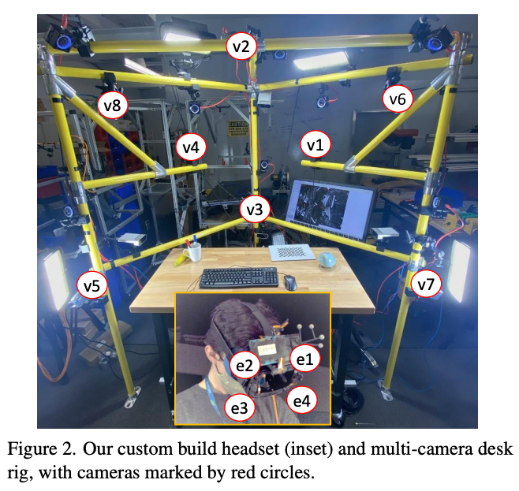
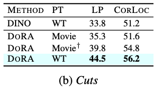
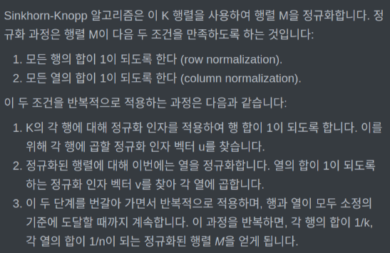
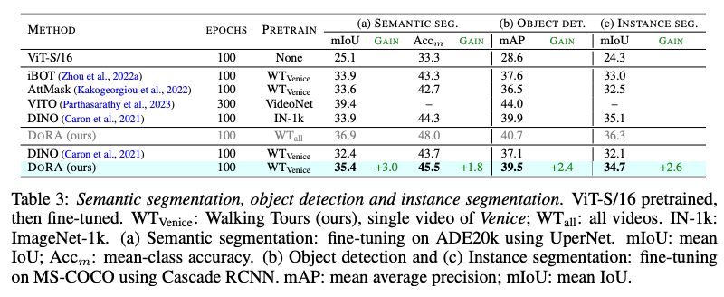
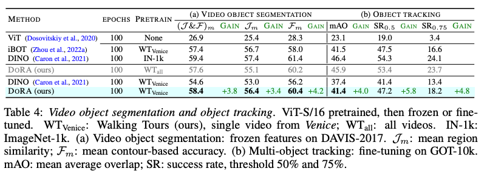
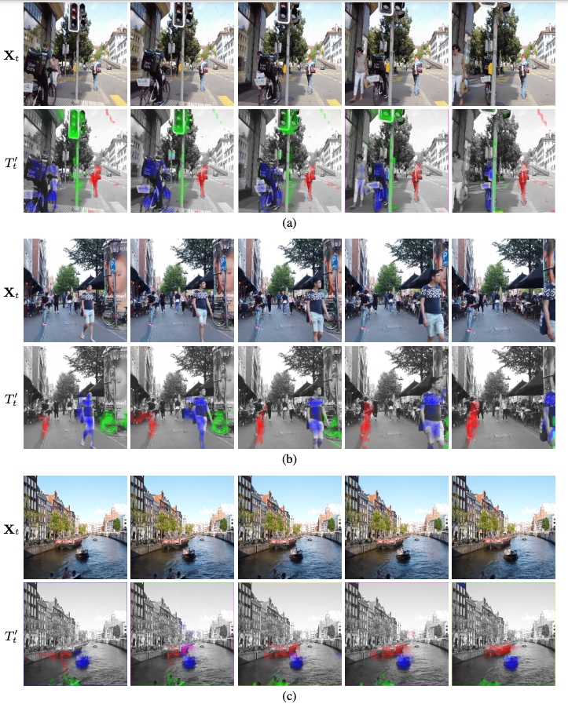

Is ImageNet worth 1 video? Learning strong image encoders from 1 long unlabelled video
===
ICLR 2024, arxiv 23.10  
####
사람이 시각 시스템을 배우는 것은 수면을 기준으로 구분된 영상을 통해 배운다고 생각할 수 있다.  
* 편집되지 않은 1~3시간짜리 walking tours dataset을 제안한다.  
* 객체 중심이 아닌 이 영상을 통해 self-supervise 학습을 하는 DoRA를 제안한다.  

이렇게 했을 때 "tracks to learn to recognize"한 end-to-end 학습이 가능하다.  
***
## Walking Tours Dataset  
### Dataset collection and properties  
  
* 유투브에서 수집한 60프레임 4k 여행 영상 10의 사파리 영상부터 다양한 도시에서 촬영된 영상  
  * 각 영상안에는 여러 객체와 행동들이 묘사되어있다.  
  * 시간에 따른 조명이 자연스럽게 점진적으로 변화한다.  
  * 도심>시장, 주거>공원 등으로 장소의 전환이 자연스럽다.
  * 자세, 물체의 상대적 위치, occlusion 등의 자연스러운 다양한 augmentaion이 적용되어있다.  

이러한 점들이 이 데이터셋의 매력적인 요소이다.  
당연하게도 이것들에 대한 labeling은 거의 불가능하기 때문에 un-supervised로 학습해야한다.  
####
### Comparison with other video datasets  
  
* 기존에는 대부분 짧고 저해상도 영상이다.  
* 기존 ego centric 데이터는 길고 고품질이긴 하지만 상당한 수작업이 들어간다.  
  * 
  *   
* 기존에 walking tour 영상도 있긴한데 공개되어 있지 않고, self-sup도 아니다.
####
### Dataset analysis  
  
* 기존 데이터셋들에 비해서 점진적인 밝기 변화를 가진다.  
* 다른 데이터셋보다 클래스나 객체 수가 더 많다.  
  * 이로 인해 다른 데이터셋보다 더 풍부한 의미론적인 내용을 포함하고 있다.
* 장면에 전환도 다른 데이터셋보다 현저히 적다.  
  * 장면 전환이 적다는 것은 그만큼 object tracking에 유리하다는 것이다. 영화 데이터셋으로 비교해본 결과 성능의 차이가 있음을 확인했다.
  *   
####
## Attention-based Multi-object tracking  
  
### Preliminaries  
* t0, t시점의 프레임이 입력 > hw/p^2개의 패치로 분할
* 여기에 CLS 토큰을 붙여서 총 n+1개의 embedding을 사용
* DINO를 따라서 EMA update
### Discovering objects with muli-head attention  
teacher의 2nd last layer에서 Q,K 구하고 각각 h개의 해드로 분할   
Q=[Q1,..., Qh], K = [K1,..., Kh]
####
이후 각각 self-attention을 한다.  

####
* A^[CLS]: 각 attention matrix에서 1행에 대해 1열을 제외한 나머지 값을 가져온다.
  *   
  * 이는 각 [CLS]토큰이 해당 패치에 얼마나 attention하는지를 나타낸다.  
####
* 무작위 k개의 헤드를 선택하고 이 헤드들의 A^[CLS]를 세로로 쌓아서 A^I을 만든다.
* 여기에 [CLS]를 제거한 Q와 곱하여 object prototype을 만든다.  
  * 
####  
  
이 prototype을 Cross-attention하는 방식으로 tracking을 한다.  
####
하지만 이렇게 얻은 k개의 attention map이 겹친다.  
즉, 각 attention map이 단일 객체를 완벽하게 묘사하지 못한다.  
> figure 4에서는 초록색이 빨간색 영역에, 파란색이 초록색 영역에 침범한 것으로 이해하면 된다.
 

###
### Establishing object-patch correspondences
그래서 저자는 각 프로토타입이 특정 단일 객체에 매칭되도록 하기 위해 Sinkhorn-Knopp 알고리즘을 사용한다.  
* 일단 prototype과 패치 임베딩 Z~의 음수 곱을 비용 행렬 C로 둔다. 
  *   
  * 즉 각 원소들 사이의 비용을 의미하는 것으로 매칭이되어야하는 (유사도가 높은) 쌍에 해당하는 원소는 값이 작아야 한다.
* 이 비용 행렬을 다음과 같이 변환하여 SK알고리즘을 사용한다.  
  * 
> Claude한테 물어보니 Gibbs 분포의 pdf라고 한다.  
> 비용이 낮을수록 높은 확률값으로 변환하면서 양수가 되게 하기 위함으로 이해했다.  
####

> 주영님의 Sinkhorn-Knopp 알고리즘 설명, 이보다 자세한 설명을 못찾아서 그대로 가져왔습니다.  
####
이렇게 구한 M*은 유사도가 높을수록 큰 값을 가지고, 이를 가중치로 패치 임베딩에 다시 곱하여 정제된 prototype을 얻는다.  
  
###
### Multi-object masking  
최종적으로 K~에 P'을 곱하여 multi-object mask를 만든다.  
이 마스크의 각 행렬은 각 객체에 대한 attention map으로 볼 수 있다.
각 행을 reshape하여 마스킹한 객체들에 대한 student의 예측과 global view를 본 teacher의 예측에 간에 CE Loss를 적용한다.  
##
## Experiments  

   
* k: 랜덤 선택한 object 개수, k가 클수록 작은 객체에 대해서 평가해야하기 때문에 감소함
* SK를 쓰지 않아도 준수한 성능이 나온다. 결국 object masking한 것이 성능향상에 더 크게 기여한 것이다.  
####
  
* WT_venice: 영상 1개만 사용, 하나씩 다 실험해봤을 때 venice만 사용한 결과가 가장 좋았다고 appendix에 있음
####
  
####                       
  
WT_all이 영상 10개짜리니까 WT_venice의 단순히 10배정도 되는데 성능 향상의 폭이 크지 않다.
####

